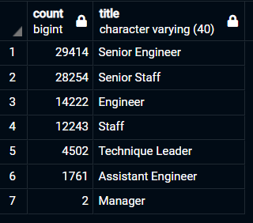

# Pewlett-Hackard-Analysis

## Project Overview
Determine the number of retiring employees per title, and identify employees who are eligible to participate in a mentorship program by:
- Retrieving Employee info from 2 tables into a new, retirement_titles table. 
- Create a new table that distiguishes unique titles, unique_titles table.
- Query number of employees by most recent job title about to retire, retiring_titles table.
- Query current employees for eligibility of mentorship program based on birthdate.

This information will be used to determine: 
- How many roles will need to be filled.
- If there are enough qualified, retirement-ready employees in the departments to mentor the next generation of Pewlett Hackard employees.

## Resources 
- Data Sources:  PH-EmployeeDB(Employee_Database_challenge.sql) -- There are sample files in the 'Resources' folder where the data tables were created from.
- PostgreSQL 11.14

## Results
- Senior Engineers and Senior Staff have the largest pool of retirement-age employees (29,414 and 28,254 respectively).

- There are 90,398 total employees nearing retirement.

- There are only 1,549 eligible mentors for the PH.

- 42,468 Employees held more than one title at PH.

## Summary:

The number of employees entering retirement is over fity times as much as the amount of eligible mentors, 90,398 and 1,549 respectively.
1. Many of the retirement-eligible employees held multiple positions:

	- Using the following query, we can create a new table and count how many workers held multiple titles:
		
		SELECT emp_no, COUNT(emp_no)
		INTO worked_multiple
		FROM retirement_titles
		GROUP BY emp_no
		HAVING COUNT(emp_no)>1;

		SELECT COUNT (emp_no)emp_no FROM worked_multiple;

2. We can determine the amount of individuals not retirering or mentoring by combining the the total workers either mentoring or tutoring, and subtracting them from the total amount of current working employees:

	- Total current employees using:
		
		SELECT 
		(SELECT COUNT (*) FROM employees) - 
		(SELECT COUNT (*) FROM mentorship_eligibility)-
		(SELECT COUNT (*) FROM unique_titles) AS Difference;
	
	- The total amount of remaining workers is 208,077! With only 1,549 eligible mentors, there are 134 employees to every 1 available mentor. 
